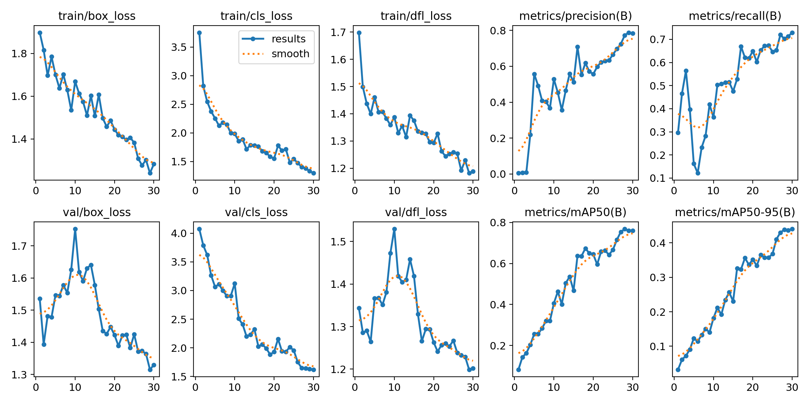
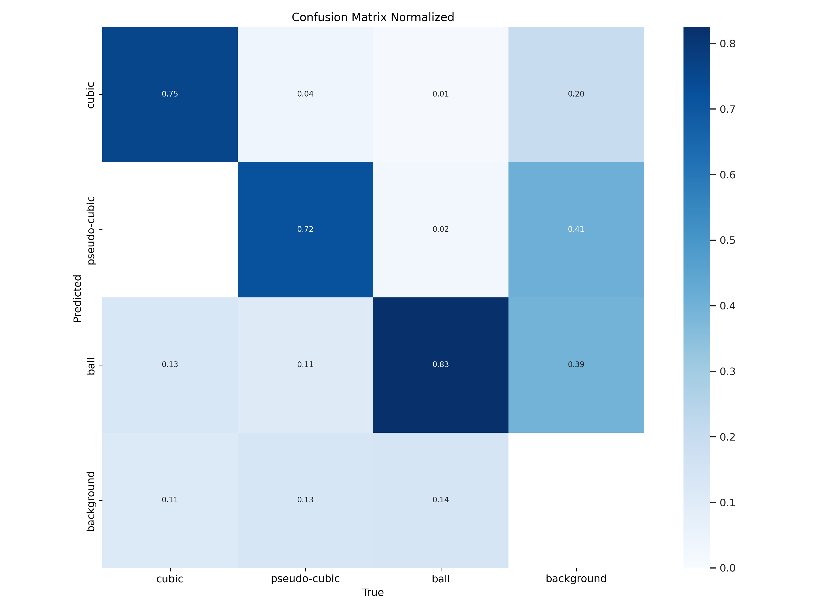
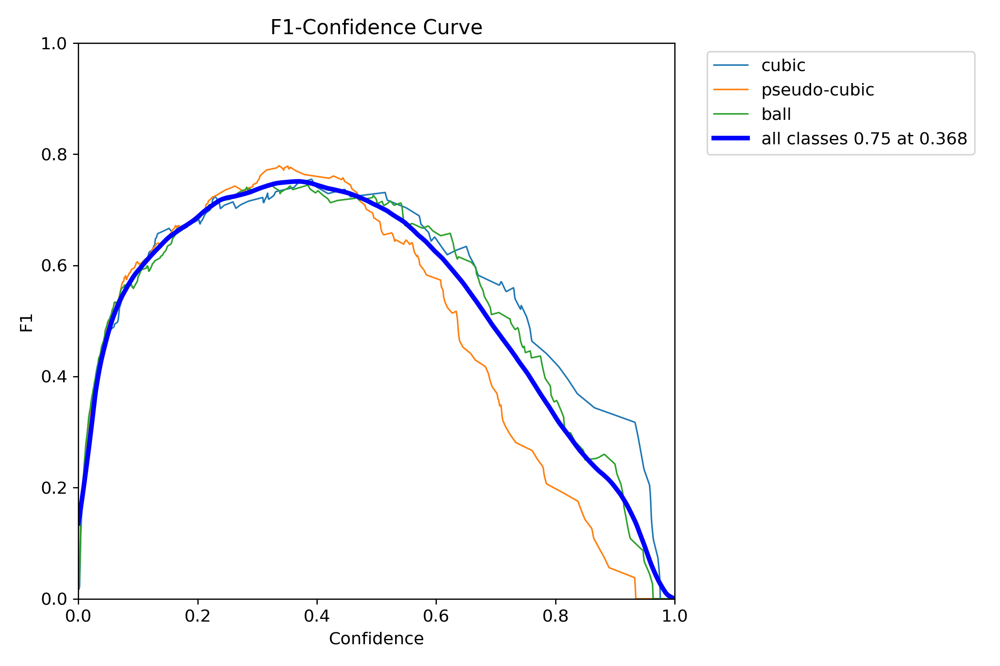

# Nanocrystal Detection with YOLOv8

Computer vision pipeline for detecting and classifying calcium carbonate nanocrystals in SEM (Scanning Electron Microscope) images. Developed at **Efrei's INNOLab** as part of a research project on sustainable construction materials.

Nanocrystal morphology (cubic vs. pseudo-cubic vs. spherical) affects the mechanical properties of the resulting material. This pipeline automates classification to replace slow manual analysis.

---

## Pipeline overview

```
Raw SEM images (.bmp)
        │
        ▼
┌───────────────────────────────┐
│  Stage 1: Unsupervised        │  VGG16 features -> PCA -> KMeans
│  Clustering                   │  Explore morphology groups across zoom levels
└───────────────────────────────┘
        │
        ▼
┌───────────────────────────────┐
│  Stage 2: Annotation &        │  Manual bbox annotation + patch-pasting
│  Data Augmentation            │  augmentation on SEM backgrounds
└───────────────────────────────┘
        │
        ▼
┌───────────────────────────────┐
│  Stage 3: YOLOv8 Training     │  Trained on ~1200 images (500 base + augmented)
└───────────────────────────────┘
```

**3 classes:** `cubic` · `pseudo-cubic` · `ball`

---

## Results

| Metric | Value |
|--------|-------|
| mAP@50 | **0.760** |
| mAP@50-95 | **0.440** |
| Precision | 0.784 |
| Recall | 0.730 |

*YOLOv8n · 30 epochs · 640×640 · ~500 base images + augmentation*



| Confusion matrix | F1 curve |
|:---:|:---:|
|  |  |

---

## Repository structure

```
├── src/
│   ├── clustering.py          # Stage 1: VGG16 + PCA + KMeans clustering
│   ├── data_augmentation.py   # Patch-based synthetic image generation
│   ├── train_yolo.py          # YOLOv8 training (config-driven, no Colab dependency)
│   ├── predict.py             # Single-image inference
│   ├── evaluate.py            # Parse training metrics from results.csv
│   └── annotate.py            # Manual annotation tools (annotate / convert / visualize)
├── notebooks/
│   └── exploration.ipynb      # End-to-end walkthrough of the full pipeline
├── assets/
│   ├── sample_images/         # Example SEM images (add your own)
│   └── results/               # Training plots and curves
├── data/
│   └── README.md              # Dataset format documentation
├── yolo_results/train2/
│   ├── weights/best.pt        # Trained model weights
│   └── results.csv            # Per-epoch training metrics
└── requirements.txt
```

---

## Setup

```bash
pip install -r requirements.txt
```

---

## Usage

**Stage 1: Clustering (unsupervised exploration):**
```bash
python src/clustering.py --bmp-dir path/to/bmp --n-clusters 10
# Zoom x1 experiment:
python src/clustering.py --bmp-dir path/to/bmp_zoom1 --n-clusters 6 --n-components 120
```

**Stage 2a: Annotation:**
```bash
# Draw bounding boxes interactively → JSON
python src/annotate.py annotate --input images/ --output annotations/
# Convert JSON → YOLO format
python src/annotate.py convert --json-dir annotations/ --image-dir images/ --output labels/
# Verify a label file
python src/annotate.py visualize --image images/001.jpg --labels labels/001.txt
```

**Stage 2b: Data augmentation:**
```bash
python src/data_augmentation.py --background background/background_1.png
```

**Stage 3: Training:**
```bash
python src/train_yolo.py --data data.yaml
```

**Inference:**
```bash
python src/predict.py --image path/to/image.jpg
python src/predict.py --image path/to/image.jpg --save output.jpg
```

**Evaluate training metrics:**
```bash
python src/evaluate.py
```

---

## Context & motivation

Calcium carbonate nanocrystals are a key ingredient in next-generation construction materials. Their morphology (shape) directly influences the mechanical properties of the resulting material - cubic crystals behave differently from spherical ones. Until now, identifying and counting crystal types required slow, manual analysis of SEM images by domain experts.

This project automates that process with AI, with two goals:
- enable faster, more scalable materials research
- contribute to reducing the CO2 footprint of the construction industry by helping optimize crystal compositions

---

## Findings & conclusions

- **Clustering revealed consistent morphology groups** across zoom levels without any labels, validating the 3-class structure (cubic, pseudo-cubic, ball) before any annotation effort.
- **Data augmentation was critical:** starting from only ~500 SEM images, patch-pasting augmentation expanded the training set enough to train YOLOv8 effectively. Without it, the dataset would have been too small.
- **YOLOv8n reached mAP@50 = 0.760** with confidence scores displayed directly on images - sufficient for assisting lab researchers in real workflows.
- **Current limitation:** the model covers 3 classes. With more labeled data and domain expert input, it could be extended to identify a wider range of crystal structures, increasing both precision and applicability to more complex studies.

---

## Dataset

The full labeled dataset is not included (research data). See [`data/README.md`](data/README.md) for the expected format. Contact us for academic access.

---

## Credits

**Students:** Flavien Hunevald, Pierre Viscardi, Emmanuel Lin, Ulysse Delepoulle, Ahkkash Kandasamy

**INNOLab supervisors:** Olivier Girinsky, Alice Jondeau, Enga Luye

Project carried out at [Efrei Paris](https://www.efrei.fr) in collaboration with [INNOLab](https://innolab-swiss.eu/), as part of a research initiative on AI-assisted nanocrystal characterization for sustainable construction materials.

## License

[MIT](LICENSE)
